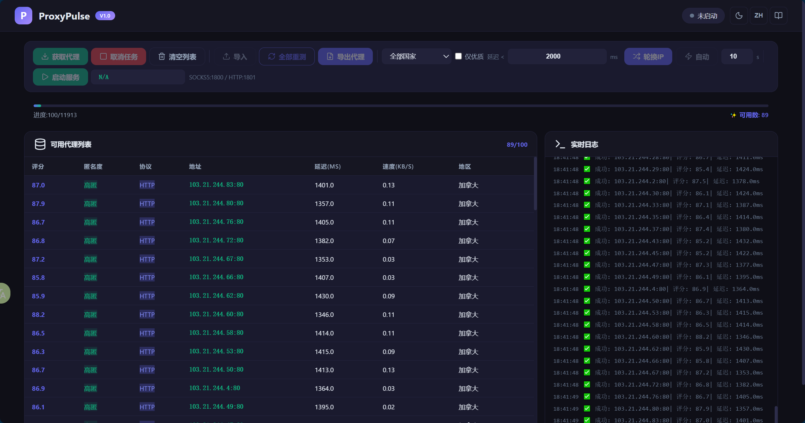

<h2 align="center">ProxyPulse</h2>
<p align="center">
  <strong>高可用免费代理池管理器</strong><br>
  <em>[Node.js Edition] · 一键启动 · 无需 Python · One-click Start, No Python Needed</em>
</p>

---

## 🖥️ Preview | 预览



---

## ✨ Features | 功能特性

- **30+ 代理数据源 / Proxy Sources** — 公开 API + 爬虫站点全覆盖
- **多协议支持 / Multi-Protocol** — HTTP / SOCKS4 / SOCKS5
- **智能验证 / Smart Validation** — TCP 预检 → 延迟测试 → 匿名度检测 → 速度测速 → 地理位置
- **IP 轮换 / IP Rotation** — 手动 Manual / 自动 Auto / 逐请求 Per-Request 三种模式
- **本地代理服务 / Local Proxy Server** — `HTTP:1801` + `SOCKS5:1800`
- **Web GUI** — 暗色/亮色主题 Dark/Light Theme + 中英双语 i18n + 实时渲染 Real-time Rendering
- **一键启动 / One-click Start** — `npm start` 即可运行

## 🚀 Quick Start | 快速开始

### Node.js

```bash
# Clone or download | 克隆或下载本项目
git clone https://github.com/Vogadero/proxy-pulse.git
cd proxy-pulse

# Install dependencies | 安装依赖
npm install

# Start! | 启动服务
npm start
```

### 🐳 Docker

```bash
docker run -d \
  --name proxy-pulse \
  -p 127.0.0.1:3456:3456 \
  -p 127.0.0.1:1800:1800 \
  -p 127.0.0.1:1801:1801 \
  -e TZ=Asia/Shanghai \
  --restart unless-stopped \
  ghcr.io/mr-xn/proxy-pulse:latest
```

> 可通过 `-e TZ=Asia/Shanghai` 参数修改容器内时区，默认为 `Asia/Shanghai`。  
> Use `-e TZ=<timezone>` to set the container timezone (e.g. `-e TZ=UTC`).

### 🐳 Docker Compose

```yaml
services:
  proxy-pulse:
    image: ghcr.io/mr-xn/proxy-pulse:latest
    container_name: proxy-pulse
    ports:
      - target: 3456
        published: 3456
        host_ip: 127.0.0.1
      - target: 1800
        published: 1800
        host_ip: 127.0.0.1
      - target: 1801
        published: 1801
        host_ip: 127.0.0.1
    environment:
      - TZ=Asia/Shanghai
    restart: unless-stopped
```

```bash
docker compose up -d
```

Open [http://localhost:3456](http://localhost:3456) in your browser. | 浏览器打开即可使用。

### Ports | 端口说明

| Service | Port | Description |
|---------|------|-------------|
| Web GUI | `3456` | Management Interface / 管理界面 |
| HTTP Proxy | `1801` | Local HTTP Proxy / 本地 HTTP 代理 |
| SOCKS5 Proxy | `1800` | Local SOCKS5 Proxy / 本地 SOCKS5 代理 |

---

## 📖 Usage Guide | 使用指南

1. Click **"Fetch Proxies" / 获取代理** — Scrape and validate free proxies from 30+ sources
2. Wait for validation (TCP pre-check → full quality test), proxies render in real-time
3. Click **"Start Service / 启动服务"** — Enable the local proxy server
4. Set browser/software proxy to `127.0.0.1:1801` (HTTP) or `127.0.0.1:1800` (SOCKS5)
5. Use **"Rotate IP / 换IP"** or **"Auto / 自动"** mode to switch proxy IPs

### Toolbar Functions | 工具栏功能

| Button | 功能 | Description |
|--------|------|-------------|
| Fetch / Cancel | 获取代理 / 取消任务 | Scrape & validate proxies, supports cancellation |
| Clear | 清空列表 | Clear current proxy pool |
| Import | 导入 | Import custom proxy list from text |
| Re-test All | 全部重测 | Re-validate existing proxies |
| Export | 导出代理 | Export working proxies to file |
| Rotate IP | 换IP | Manually switch to next available proxy |
| Auto | 自动 | Enable auto-rotation mode (configurable interval) |

---

## 🏗️ Project Structure | 项目结构

```
proxy-pulse/
├── app.js              # Express API server (port 3456)
├── public/
│   ├── index.html      # Web GUI page
│   ├── app.js          # Frontend logic (i18n, animations, real-time rendering)
│   └── style.css       # Stylesheet (CSS variables theme system)
├── modules/
│   ├── fetcher.js      # 30+ source scraper (API + cheerio crawler)
│   ├── checker.js      # TCP pre-check + latency/anonymity/speed/location detection
│   ├── rotator.js      # IP rotation manager with smart scoring
│   └── server.js       # Local proxy server HTTP(1801) + SOCKS5(1800)
├── images/             # Screenshots / 截图
├── .gitignore          # Git ignore rules
└── package.json        # Project configuration
```

---

## 🎨 UI Features | 界面特性

- **Dark / Light Theme / 暗色/亮色主题** — One-click toggle, auto-save preference
- **Bilingual / 中英双语** — Chinese / English switching
- **Real-time Rendering / 实时渲染** — Proxy list updates row-by-row during validation, no waiting for completion
- **Live Log / 实时日志** — Right panel shows validation progress and results in real-time
- **Stats Animation / 统计动画** — Available/Total count updates with dynamic effects
- **Responsive Toolbar / 响应式工具栏** — Buttons auto-adapt to different screen widths

---

## ⚠️ Disclaimer | 免责声明

Free proxies are unstable by nature. Do NOT use them for:
- 免费代理本质上不稳定，请勿用于：
- Transmitting sensitive data (passwords, tokens, banking info) / 传输敏感数据（密码、Token、银行信息等）
- Production-critical applications / 生产环境或关键业务

For production use, consider paid commercial proxy services.
生产环境建议使用付费商业代理服务。

---

## License

[MIT](LICENSE) | © Vogadero
